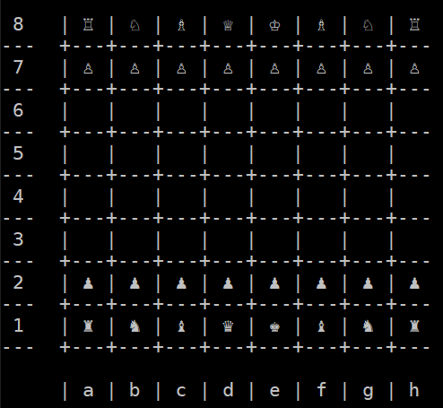

# Chess Improved

## About

This is a console program designed to allow two players to play a game of chess, complete with all features such as checkmate, castling, en passant, stalemate etc.

It is designed to be a vast improvement on my [earlier](https://github.com/swiderskis/chess) version of a chess program.

## Playing the game

Players input their moves using [algebraic notation](https://en.wikipedia.org/wiki/Algebraic_notation_(chess)).
Castling is denoted using 'O-O' or 'O-O-O', rather than '0-0' or '0-0-0'.
Promotion is indicated using e.g. 'e8=Q'.

During their turn, players can also input various commands, including: 'resign' to resign the game, 'draw' to offer their opponent a draw, 'save' to save the current game state into a file, and 'load' to load a saved game.
(THESE COMMANDS ARE CURRENTLY UNIMPLEMENTED)

## Unicode characters in Windows console

By default, the pieces are denoted in the console by their unicode characters.
I'm not certain on how this works on Linux / Mac, but displaying these in a Windows console is... tedious.
I managed to make this work on Windows 10 by [enabling UTF-8 support](https://stackoverflow.com/questions/7432545/change-codepage-in-cmd-permanently), and [installing a console font](https://stackoverflow.com/questions/27483800/displaying-unicode-chess-pieces-in-windows-console) which contains symbols for the Unicode characters.
This may differ for older versions of Windows or for other C++ compilers.

In the future, I plan on adding a config file which allows the unicode characters to be toggled off, and replaced with regular ASCII letters (e.g. 'K' for white king, 'k' for black king).
